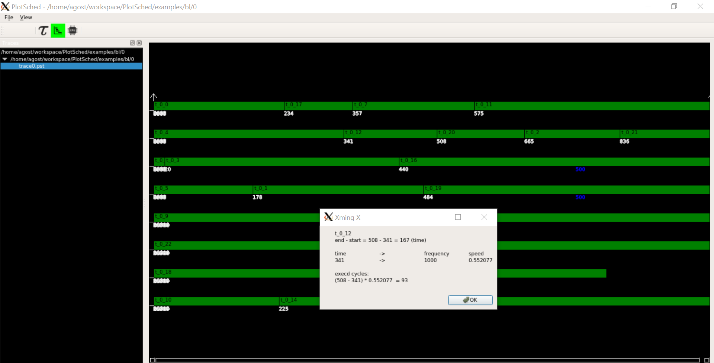

# PlotSched

Scheduling traces plotter

* Initial development, November 2015
* Different views (Gannt and from tasks viewpoint) and ARM big.LITTLE support - January 2020 - February 2020
  * version 2.0 (not git-tagged)
* DAG support - March 2020 - now
  * version 2.5



----
## Authors

* Alessio Balsini (a.balsini@sssup.it) - original author
  *  https://github.com/balsini/PlotSched
* Agostino Mascitti (a.mascitti@santannapisa.it)
  * https://github.com/HerrAugust/PlotSched

License: GPL 2.0

----
## Notes from the authors
This software has been made for supporting the
development on RTSim, an open-source real-time
tasks simulator.

> It is not meant to be a general tool, but
> you might find it **easier to modify this
> software for your own needs**.

----
## Introduction

PlotSched is a flexible tool for graphically showing (general) events stored in a file.

It was born by the need of having a flexible and straightforward tool for quickly showing the scheduler behaviour.

----

## Instructions

In the following sections are presented the steps required for compiling the tool and the instructions for running it.

### Dependencies

This tool requires the `Qt5 SDK`.
Also `xdot` is required to show graphs, optionally.

### Compiling

Being a Qt5 project, it is required to generate the makefile.
Enter into directory `src/` and type:

```
cd src/
qmake PlotSched.pro
```

This produces the makefile file `Makefile`, that can be directly used for compiling:

```
make
```

Now, the executable `PlotSched` is generated and can be run:

```
./PlotSched
```

Select the icons folder in the menu above and select the folder `PlotSched/examples/bl/0/`.
Then, select the only `.pst` file available. You should get the screenshot above.

### In your code

main.cpp

```sh
PSTrace  pstrace("trace.pst");

PeriodicTask* t = new PeriodicTask(200, 200, 0, task_name);
t->insertCode("fixed(10,bzip2)");
pstrace.attachToTask(*t);

...

SIMUL.run(400);
```

where PeriodicTask and PSTrace are classes of RTSim.

### Some notes
This version has been especially thought for ARM big-LITTLE,
an architecture in which cores can change frequency. Thus, also tasks WCET change.

### Usage - base version

The file extension is `.pst` (Plot Sched Trace).

The file format used by `PlotSched` is the following:

```
<time> <entity> <CPU> <event name> <event status>
```

Where:
* `time` is the time at which the event is generated;
* `entity` is the subject that generated the event;
* `CPU` is the CPU on which the entity was running;
* `event name` is the event identifier;
* `event status` is the kind of event and can be:
  * `I` for instantaneous events (that start and finish at the same time);
  * `S` defining that an event (range event) just started;
  * `E` defining that an event (range event) just finished;

The tool recognizes any row as an event.

Examples of `.pst` files can be found in `examples/` folder.


To enlarge the trace, hold the right button of your mouse and slide it.

#### Rules

Because of how the tool is implemented, the following rules apply:
* it is not possible to have at the same time the same event generated by the same entity;
* every range event that started, must finish;
* an event cannot finish without starting before.


### Usage in ARM Big-LITTLE
The ARM big-LITTLE architecture supports frequency
changes.

Some more files are required (but not mandatory):
* freqBIG.txt
```
<time: int> <frequency: int>
```
* freqLITTLE.txt
  * see format before
* tasks.txt
```
<name: str> <budget: int> <WCET: int> <period: int> <rel dl: int>
```
* cpus.txt (below 4 big and 2 LITTLE cores)
```
BEGIN ISLAND big
0
1
2
3
END ISLAND
BEGIN ISLAND LITTLE
4
5
END ISLAND
```

Examples are in `PlotSched/examples/bl/short/` and
`PlotSched/examples/bl/0/`.

### Usage - DAG
If you also need DAG support, the following files are required:
* graphs.txt
  * contains the path (possibly relative) to the graphs
  * inside such path there are 0..N folders. Say this path is `path_graphs/n/`.
```
<path: str>
```
* <str>_adj_mx.txt
  * adjacency matrix of the graph
```
1 0 0
0 1 0
0 0 1
```
* bindings.txt
  * binds a node (i.e., a row of the adjacency matrix) to a task
  * this is needede for backward compatibility (`oneTask->setNode(node)`)
  * `name` refers to a task in `tasks.txt` (see above)
```
<adj mx row: int> <task name: str>
```
* <str>.gv
  * dot file of the graph (optional)
* <str>_dl.txt
  * graph deadline
```
<deadline: int>
```
* <str>_wcet.txt
  * for each node, its node WCET
```
<wcet node 1: int> <wcet node 2: int> ... <wcet node n: int>
```
* <str>.png
  * an image of the DAG, to be shown when clicking on a task rectangle
  * optional

Examples are in `PlotSched/examples/bl/dag/`.
